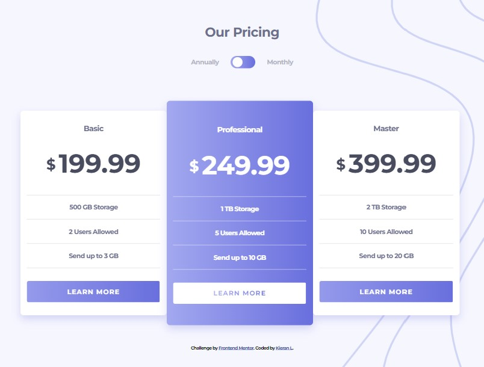

[View live site](https://kilelx.github.io/Pricing-Component/)

# Frontend Mentor - Pricing component with toggle solution

This is a solution to the [Pricing component with toggle challenge on Frontend Mentor](https://www.frontendmentor.io/challenges/pricing-component-with-toggle-8vPwRMIC). Frontend Mentor challenges help you improve your coding skills by building realistic projects. 

## Table of contents

- [Overview](#overview)
  - [The challenge](#the-challenge)
  - [Screenshot](#screenshot)
  - [Links](#links)
- [My process](#my-process)
  - [Built with](#built-with)
  - [What I learned](#what-i-learned)
- [Author](#author)

## Overview

### The challenge

Users should be able to:

- View the optimal layout for the component depending on their device's screen size
- Control the toggle with both their mouse/trackpad and their keyboard

### Screenshot

### Links

- Live Site URL: [View live site](https://kilelx.github.io/Pricing-Component/)

## My process

### Built with

- HTML5
- CSS3
- JavaScript

### What I learned

Where I had the most difficulties is in the dimensions. Indeed, I faced some issues with the width, especially when the price changed from monthly to annually (adding one number).

## Author

- Website - [Kieran LELEUX](http://www.kieran-leleux.com)
- Frontend Mentor - [@kilelx](https://www.frontendmentor.io/profile/kilelx)
